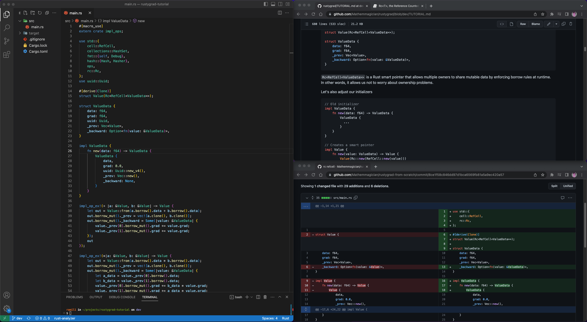

**Note**: This is a tutorial repository which teaches you how to build [Rustygrad](https://github.com/Mathemmagician/rustygrad)
 from scratch.

# Who is this for?

- You have some familiarity with Rust, and maybe even read [The Book](https://doc.rust-lang.org/book/) once
- You are curious about Neural Nets
- You feel like building things from scratch helps you understand them better

# How does this work?

Open your [favorite editor](https://code.visualstudio.com/download) and [The Tutorial](https://github.com/Mathemmagician/rustygrad/blob/dev/TUTORIAL.md).

As you go through the tutorial, the accompaning code changes can be found in this repo's commits (There are only 10 of them)

The tutorial is short. There will be things you don't understand. Use it as an opportunity to research the topic further if you are interested (unless you feel like I wrote some undigestable nonsense, which is totally possible, in which case let me know)

If your setup looks like this, you are doing it right:

Good Luck!
